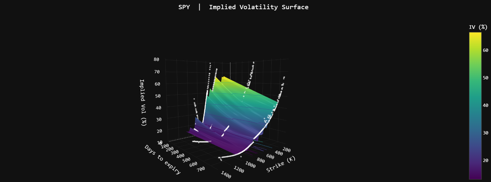
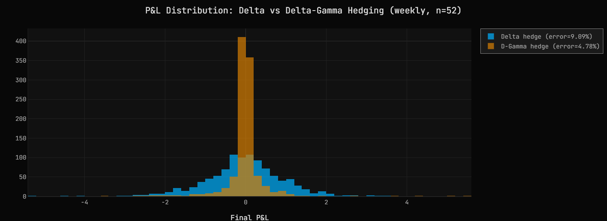
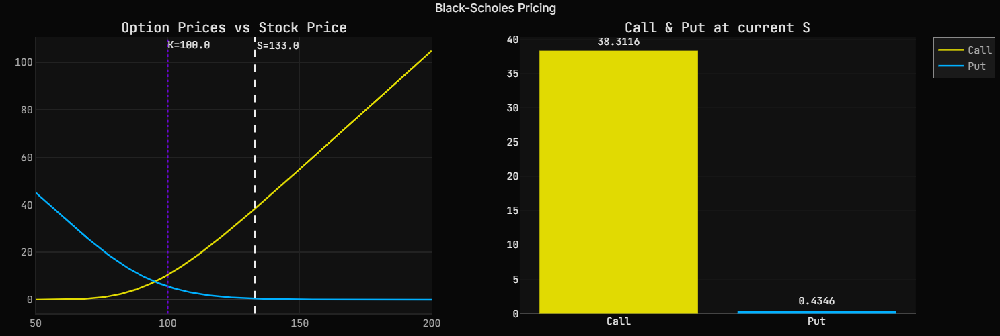
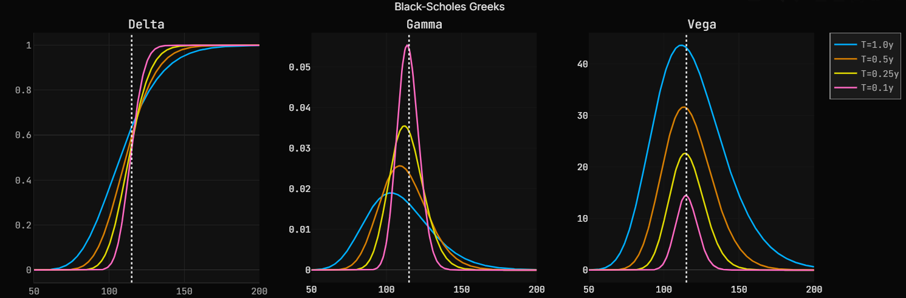
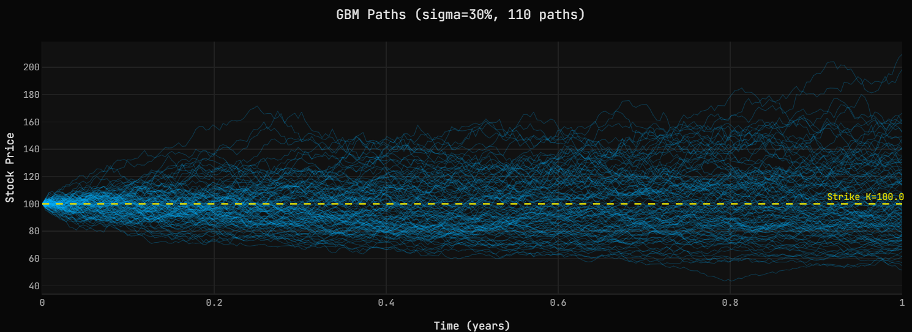
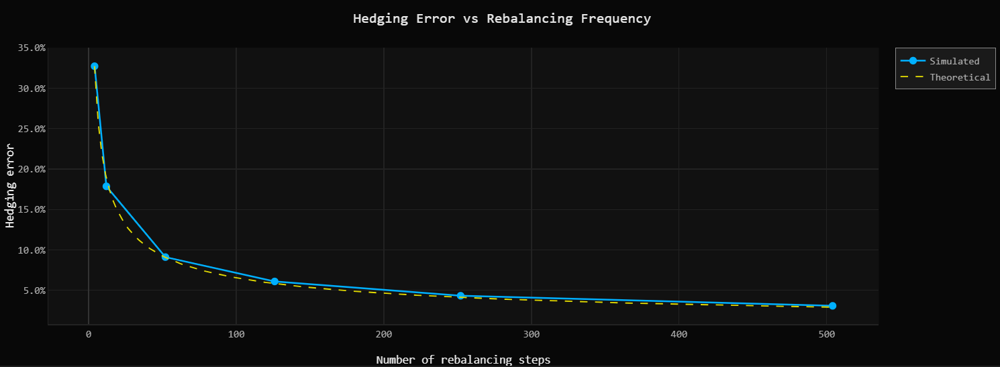

# Delta & Gamma Hedging Simulation — European Options


[](https://mybinder.org/v2/gh/williamcheymol/delta-hedging/main?filepath=notebooks/visualization.ipynb)

A self-contained Python project simulating the delta and gamma hedging of European options under Black-Scholes assumptions, extended with live implied volatility surfaces from real market data.

---

## Background

### Black-Scholes pricing

Under the Black-Scholes model, the stock price follows a Geometric Brownian Motion (GBM):

$$dS = \mu S \, dt + \sigma S \, dW$$

Under the risk-neutral measure ($\mu \to r$), the price of a European call option with strike $K$ and maturity $T$ is:

$$C = S \cdot N(d_1) - K e^{-rT} \cdot N(d_2)$$

$$d_1 = \frac{\ln(S/K) + (r + \sigma^2/2) \cdot T}{\sigma\sqrt{T}}, \qquad d_2 = d_1 - \sigma\sqrt{T}$$

where $N(\cdot)$ is the cumulative standard normal distribution. The put price follows from put-call parity: $P = C - S + K e^{-rT}$.

### The Greeks

| Greek | Formula | Interpretation |
|-------|---------|----------------|
| **Delta** $\Delta$ | $N(d_1)$ | Price change per €1 move in $S$ |
| **Gamma** $\Gamma$ | $\frac{N'(d_1)}{S \sigma \sqrt{T}}$ | Rate of change of delta |
| **Vega** $\nu$ | $S \cdot N'(d_1) \cdot \sqrt{T}$ | Price change per 1% move in $\sigma$ |

Gamma is highest when the option is at-the-money (S ≈ K) and near expiry — this is when the delta changes most rapidly and hedging is hardest.

### Delta hedging

When a trader sells an option, they take on directional risk. **Delta hedging** neutralises this by holding $\Delta$ shares per option sold, making the portfolio locally immune to small price changes.

In continuous time, perfect delta hedging replicates the option exactly — the portfolio P&L is zero. In practice, hedging is discrete (e.g. daily), which introduces a residual **tracking error** that scales as:

$$\text{Hedging error} \propto \sigma \sqrt{\frac{T}{n_{\text{steps}}}}$$

The P&L at each rebalancing step decomposes into:
- **Gamma P&L** $= \frac{1}{2} \Gamma (\Delta S)^2$ — profit from realised price moves (convexity)
- **Theta cost** $= -\frac{1}{2} \Gamma \sigma^2 S^2 \, dt$ — cost of holding gamma over time

These two terms cancel exactly in continuous time. The residual is the discretisation error.

### Gamma hedging

Delta hedging leaves the portfolio exposed to **gamma risk** — large moves in $S$ cause the delta to shift and the hedge to break down. **Gamma hedging** adds a second option position to neutralise gamma simultaneously:

$$h_2 = \frac{\Gamma_{\text{target}}}{\Gamma_{\text{hedge}}} \qquad \text{(gamma neutrality)}$$

$$h_1 = \Delta_{\text{target}} - h_2 \cdot \Delta_{\text{hedge}} \qquad \text{(delta neutrality)}$$

With both delta and gamma neutralised, the portfolio is protected against larger moves and the hedging error is significantly reduced, especially at low rebalancing frequencies.

### Implied volatility surface

In practice, a single flat volatility $\sigma$ does not match observed market prices. The **implied volatility surface** $\sigma(K, T)$ maps each (strike, maturity) pair to its market-implied vol, revealing:

- **Volatility skew**: OTM puts trade at higher IV than OTM calls — the market prices downside tail risk
- **Term structure**: IV varies across maturities, reflecting near-term uncertainty vs long-run mean reversion

The surface is built from live option chains (via yfinance) using Radial Basis Function interpolation, then used as the local vol input for the hedging simulation.

<table>
<tr>
<td>



</td>
<td width="40%">

The **volatility skew** is clearly visible — OTM puts (low strikes) carry significantly higher IV than OTM calls, reflecting the market's asymmetric fear of downside moves. The **term structure** shows short-dated vol spiking above the long-run level.

This is the empirical failure of Black-Scholes flat-vol assumption — and exactly the additional risk the market surface hedging simulation (section 10) quantifies.

</td>
</tr>
</table>

---

## Key results

| Metric | Value |
|--------|-------|
| Call price (ATM, T=1, σ=20%) | 10.45 |
| Delta hedge error — flat vol (1M paths, daily) | **4.18%** |
| Delta hedge error — market vol surface (1M paths, daily) | **10.40%** |
| Gamma hedge error (weekly, 1M paths) | **5.16%** vs 9.08% delta |

<table>
<tr>
<td>


</td>
<td width="38%">

The blue distribution (flat vol, BS) is tight and centred — the hedge works well when the model matches reality. The orange distribution (market surface) is significantly wider: the hedger now faces genuine vol surface complexity — skew and term structure — that the flat-vol delta cannot neutralise.

The 10.40% error vs 4.18% quantifies exactly **how much the volatility smile costs** a delta hedger.

</td>
</tr>
</table>

<table>
<tr>
<td width="38%">

Adding a second option to neutralise gamma simultaneously reduces the weekly hedging error from **9.08% to 5.16%** — a 43% improvement at the same rebalancing frequency. The orange distribution (gamma hedge) is dramatically tighter, almost spike-like compared to the broad flat delta hedge.

</td>
<td>



</td>
</tr>
</table>

---

## Features

**Pricing**
- Black-Scholes call and put pricing
- Full Greeks: delta, gamma, vega
- Put-call parity verification

**Simulation**
- Geometric Brownian Motion (GBM) — vectorised across paths
- Antithetic variates for variance reduction
- Chunk-based simulation for up to 1M paths with bounded memory (~200 MB/chunk)
- Reproducible seeded runs

**Hedging**
- Discrete delta hedging with configurable rebalancing frequency
- Delta-gamma hedging (second option to neutralise gamma simultaneously)
- Transaction costs
- Volatility mismatch analysis ($\sigma_{\text{hedge}} \neq \sigma_{\text{real}}$)
- P&L attribution: gamma P&L vs theta cost

**Implied volatility surface**
- Live option chain download via yfinance
- RBF interpolation (thin-plate spline) on scattered (K, T) market data
- OTM-only filtering for a clean, arbitrage-consistent surface
- `build_fast_grid`: precomputes a 200×100 grid once, then O(1) bilinear IV lookup during hedging (100–1000× faster than direct RBF)
- Interactive 3D surface plot and volatility smile by maturity

**Analysis & Visualisation**
- Hedging error vs rebalancing frequency
- Vol mismatch impact on P&L (mean and std)
- Delta vs gamma hedging comparison
- P&L distribution on real market vol surface vs flat vol
- Interactive Plotly dashboard with ipywidgets sliders
- Quant Dark design system (centralised colour palette + Plotly layout template)

**Testing**
- 53 unit tests across 4 modules (pytest)
- Algebraic tests (exact tolerances) and statistical tests (Monte Carlo tolerances)

---

## Project structure

```
delta-hedging/
├── config.py                   # Market & simulation parameters
├── main.py                     # Pipeline entry point
│
├── pricing/
│   └── black_scholes.py        # BS pricing + Greeks (delta, gamma, vega)
│
├── simulation/
│   └── monte_carlo.py          # GBM path generation, antithetic variates
│
├── hedging/
│   ├── delta_hedge.py          # Delta hedging loop, P&L attribution, chunked runner
│   └── gamma_hedge.py          # Delta-gamma hedging
│
├── analysis/
│   ├── metrics.py              # Hedging metrics, frequency & vol mismatch analysis
│   └── vol_surface.py          # Implied vol surface — RBF fit, fast grid, plots
│
├── style/
│   └── theme.py                # Quant Dark palette + Plotly layout template
│
├── notebooks/
│   └── visualization.ipynb     # Interactive dashboard (10 sections)
│
├── tests/
│   ├── test_pricing.py         # 18 tests — BS pricing & Greeks
│   ├── test_simulation.py      # 10 tests — GBM properties & antithetic variates
│   ├── test_hedging.py         #  9 tests — hedging P&L & gamma neutrality
│   └── test_vol_surface.py     # 16 tests — RBF surface, fast grid, IV queries
│
└── results/
    ├── data/                   # Generated CSVs
    └── figures/                # Saved charts
```

---

## Quickstart

```bash
# 1. Install dependencies
pip install -r requirements.txt

# 2. Run the simulation
python main.py                    # flat-vol only — no external data required
python main.py \
  --csv path/to/SPY_options.csv \ # + market vol surface comparison
  --spot 741.41

# 3. Open the interactive notebook
jupyter notebook notebooks/visualization.ipynb

# 4. Run the test suite
pytest tests/ -v
```

### Mode 1 — Flat vol (standalone)

No external data required. Simulates 1,000,000 GBM paths, runs the delta hedge under constant volatility σ = 20%, and reports the hedging error.

```
====================================================
  Delta Hedging Simulation — Black-Scholes
====================================================

  Option price at t=0 : 10.4506  (ATM call, σ=20%)

[1/1] Flat-vol delta hedge  (1,000,000 paths, 252 steps)...
  1,000,000 / 1,000,000 paths  (100%)

  Hedging error (flat vol) : 4.18%
```

### Mode 2 — Market vol surface

The bundled sample data (`data/SPY_options_sample.csv`, spot=741.41) lets you run this mode immediately. To use fresher data, produce a new CSV with the [Market Fetcher](https://github.com/williamcheymol/market-data-fetcher) project first.

```bash
# With bundled sample data (no setup needed)
python main.py --csv data/SPY_options_sample.csv --spot 741.41

# Or with freshly fetched data
python main.py --csv ../market-data-fetcher/results/SPY_options.csv --spot <current_spot>
```

```
[1/2] Flat-vol delta hedge  (1,000,000 paths, 252 steps)...
  Hedging error (flat vol) : 4.18%

[2/2] Market vol surface hedge  (1,000,000 paths)...
  Loading surface from 'SPY_options.csv'  (spot=741.41)
  300 contracts · fast grid ready.
  1,000,000 / 1,000,000 paths  (100%)
  Hedging error (market surface) : 10.40%

====================================================
  Results summary
====================================================
  Flat vol (BS)   : 4.18%
  Market surface  : 10.40%
====================================================
```

The two results are saved to `results/data/pnl_flat.csv` and `results/data/pnl_surface.csv`.

---

## Market Fetcher dependency

Sections 9 and 10 of the notebook work **out of the box** using the bundled sample data:

```
data/SPY_options_sample.csv   # SPY option chain — 1 557 contracts, fetched 2025-05-19, spot=741.41
```

To use fresher market data, run the companion project:

> **[market-data-fetcher](https://github.com/williamcheymol/market-data-fetcher)** — fetches live option chains via yfinance and extracts implied volatility via Black-Scholes inversion (Brent's method).

```bash
# In the market-data-fetcher project:
python main.py   # produces results/SPY_options.csv
```

Then update `CSV_PATH` and `SPOT` at the top of section 9 in the notebook, or pass the path directly to `main.py --csv`:

```bash
python main.py --csv path/to/SPY_options.csv --spot <spot_at_fetch_time>
```

The CSV contains one row per contract with columns `strike`, `T`, `implied_vol`, `option_type`.

---

## Interactive notebook

The notebook contains 10 sections powered by Plotly and ipywidgets:

1. **Black-Scholes pricing** — call & put price with live S, K, σ sliders
2. **Greeks** — delta, gamma, vega vs spot price
3. **GBM paths** — simulated trajectories with σ slider
4. **P&L distribution** — hedging error with n_steps, transaction cost, option type sliders
5. **Hedging error vs frequency** — empirical curve with 1/√n theoretical fit
6. **Volatility mismatch** — P&L mean and std as a function of σ\_hedge
7. **Delta vs gamma hedging** — side-by-side P&L distributions at low rebalancing frequency
8. **P&L attribution** — gamma P&L vs theta cost with σ\_real / σ\_hedge sliders
9. **Implied volatility surface** — 3D surface and vol smile from live SPY option chain
10. **Market surface hedging** — delta hedge P&L using real implied vols vs flat vol baseline

---

## Technical highlights

**Chunk-based Monte Carlo** — simulating 1,000,000 paths at once would require ~16 GB of RAM. Instead, paths are generated and hedged in chunks of 50,000, keeping peak memory under 200 MB regardless of total path count. Only the final P&L array (8 MB) is retained across chunks.

**Vectorisation** — the hedging loop iterates over time steps (sequential by nature) but operates on all Monte Carlo paths simultaneously as numpy arrays. This removes the outer path loop and gives a ~100× speedup over a naive double loop.

**RBF + fast grid** — the vol surface is fitted once via Radial Basis Function interpolation (thin-plate spline) on ~300 market quotes. Direct RBF evaluation is $O(n_{\text{train}})$ per point — too slow for millions of hedging steps. `build_fast_grid` precomputes the surface on a 200×100 regular grid and returns a `RegularGridInterpolator` for $O(1)$ bilinear lookup, yielding a 100–1000× speedup during simulation.

**Antithetic variates** — for each random draw $Z$, the simulation also generates a path from $-Z$. Since log-returns satisfy:

$$\log r_1 + \log r_2 = 2\left(r - \frac{\sigma^2}{2}\right)dt$$

the noise cancels algebraically, reducing Monte Carlo variance with no additional computation.

**P&L attribution** — at each time step, the hedging error decomposes into:

$$\Pi = \underbrace{\frac{1}{2}\Gamma(\Delta S)^2}_{\text{gamma}} - \underbrace{\frac{1}{2}\Gamma\sigma^2 S^2 \, dt}_{\text{theta}}$$

The net P&L tracks the difference between realised and implied volatility.

---

## Parameters (`config.py`)

| Parameter | Default | Description |
|-----------|---------|-------------|
| `S0` | 100 | Initial stock price |
| `K` | 100 | Strike (at-the-money) |
| `T` | 1.0 | Maturity (1 year) |
| `r` | 0.05 | Risk-free rate (5%) |
| `SIGMA` | 0.20 | Volatility (20%) |
| `N_STEPS` | 252 | Daily rebalancing steps |
| `N_PATHS` | 1 000 000 | Monte Carlo paths |
| `CHUNK_SIZE` | 50 000 | Paths per chunk (memory management) |

---

## Gallery

| Pricing (call & put) | Greeks vs spot |
|:---:|:---:|
|  |  |

| GBM paths | Hedging error vs frequency |
|:---:|:---:|
|  |  |

| Call hedge — P&L distribution | Volatility mismatch |
|:---:|:---:|
|  |  |

| P&L attribution — gamma vs theta |
|:---:|
|  |

---

## Roadmap

**Phase 1 ✓** — European call & put under GBM · Delta & delta-gamma hedging · Transaction costs · Vol mismatch analysis · P&L attribution (gamma vs theta) · Interactive Plotly dashboard · 37 unit tests

**Phase 2 ✓** — Real market data via yfinance · Live implied volatility surface (RBF interpolation) · `build_fast_grid`: O(1) bilinear IV lookup during simulation · Theory vs practice: flat vol (4.18% error) vs market surface (10.40% error) on 1M paths · 16 additional unit tests
